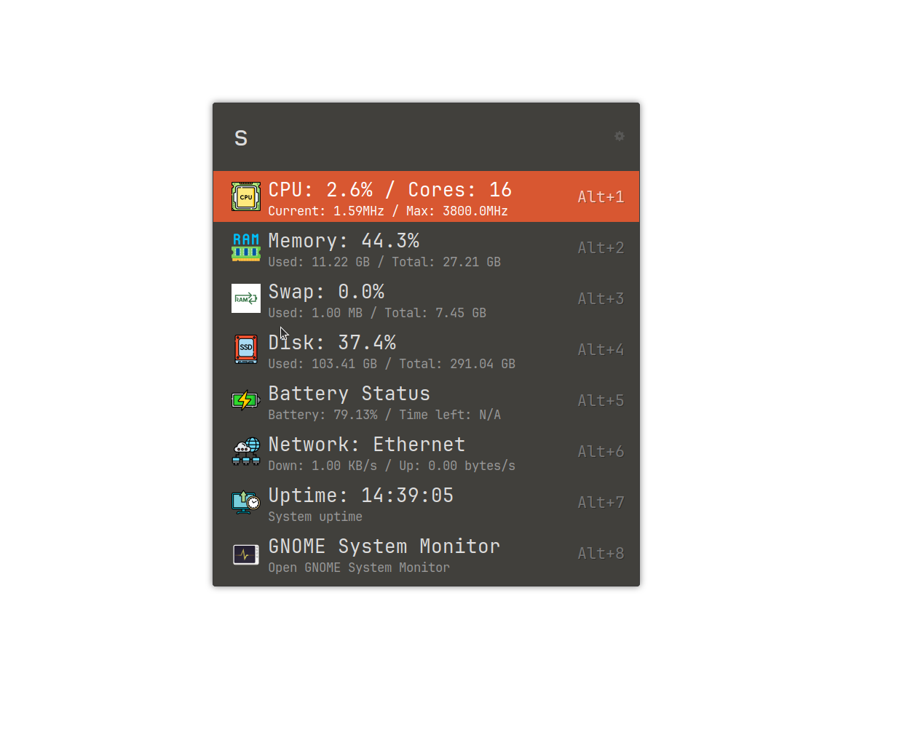

# ulauncher-system-monitor
Ulauncher System Monitor is a Ulauncher extension that provides real‑time system metrics directly within Ulauncher. Get an at‑a‑glance view of your CPU usage, memory consumption, swap usage, disk usage, network activity, battery status, and uptime—all from one unified interface.

## Screenshot

<p align="center">
  
    <br>
  <b>Extension Screenshot</b>
</p>

## Features

- **Real‑Time Metrics:**
  Displays current CPU load, memory usage, swap usage, disk space, network I/O, and uptime.

- **Battery Status**
  Shows battery percentage and system uptime.

- **Copy to Clipboard:**
  Click on any metric to copy its value for troubleshooting or record-keeping.

- **Lightweight & Fast:**
  Built with Python’s [psutil](https://github.com/giampaolo/psutil) and [Netifaces](https://github.com/raphdg/netifaces) library for minimal overhead.

## Requirements

- Ulauncher (API version 2)
- Python 3.x
- [psutil](https://github.com/giampaolo/psutil)
- [Netifaces](https://github.com/raphdg/netifaces)
- GNOME System Monitor

## Installation

- Install GNOME Systom Monitor
  ```bash
  snap install gnome-systom-monitor
  ```
- Install all required packages using pip:
  ```bash
  pip install psutil netifaces
  ```
- Open **Ulauncher**
- Click on the **cog wheel** to open your preferences
- Click on the **EXTENSIONS** tab
- Click on **Add extension**
- Paste this repository's URL (https://github.com/kazuyuki114/ulauncher-system-monitor)
